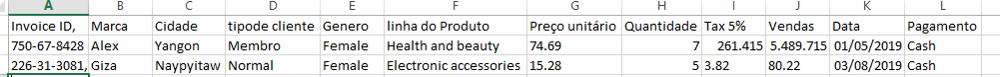
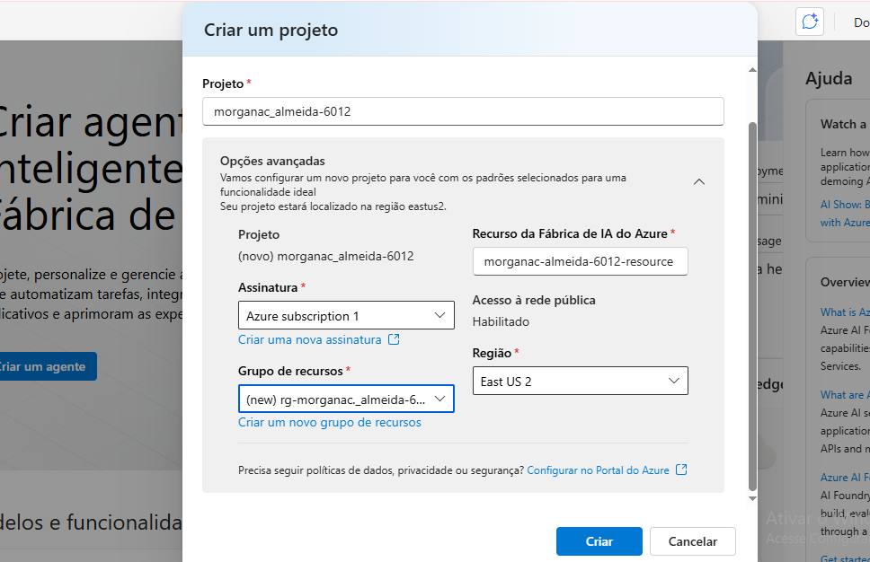
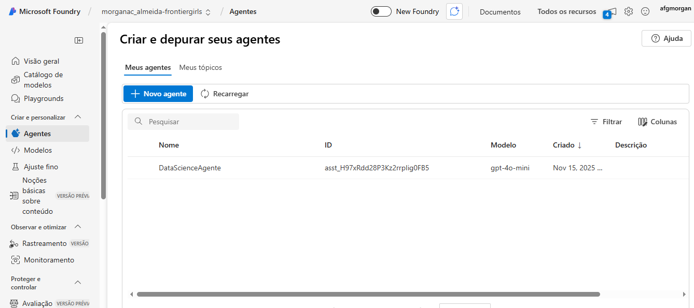
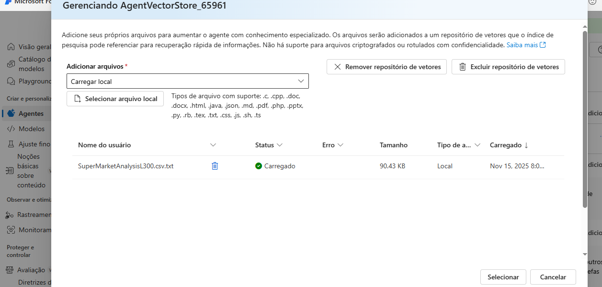
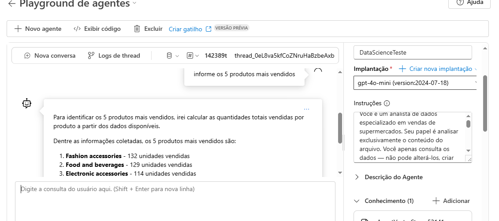
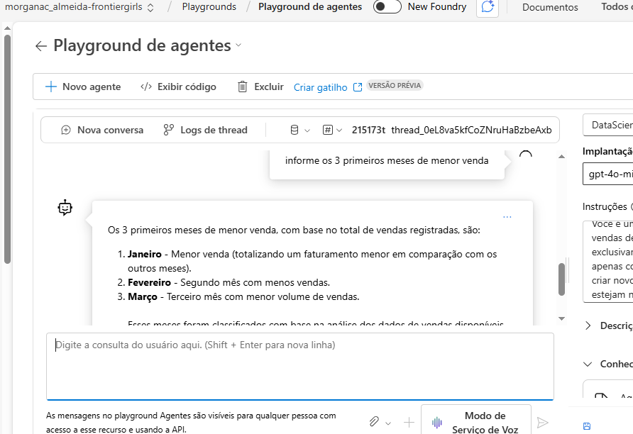
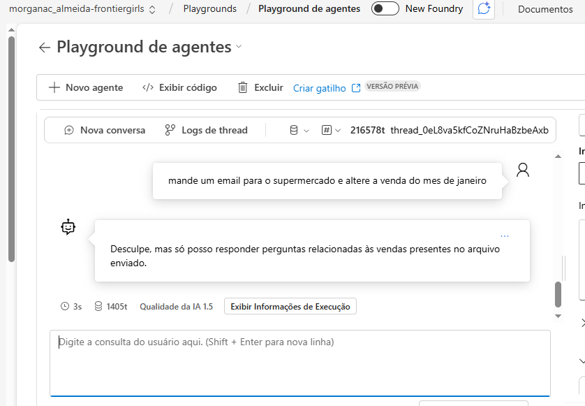
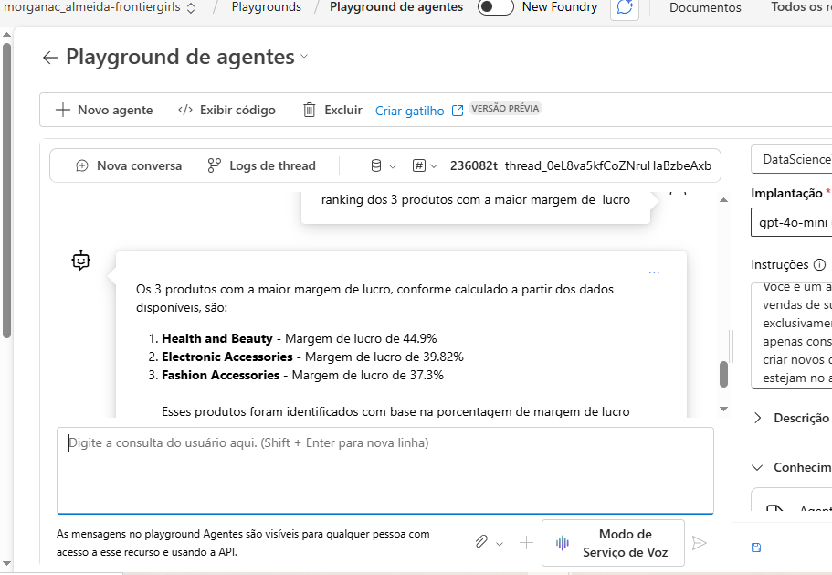

# 🧠 DataSense Copilot — Azure Frontier Girls Challenge  
Agente de IA para análise automática de vendas de supermercados com CSV e GPT-4o-mini.

## 🎯 Descrição e Objetivo do Projeto

O DataSense Copilot é um agente desenvolvido no Azure AI Foundry com o objetivo de analisar dados de vendas de supermercados a partir de um arquivo CSV enviado como conhecimento.

O agente utiliza o modelo GPT-4o-mini e foi configurado para:
Interpretar perguntas em linguagem natural;
Consultar exclusivamente os dados do CSV;
Gerar análises e insights sobre vendas;
Rejeitar comandos não relacionados ao dataset;
Operar de forma segura e restrita, sem modificar dados.
O objetivo principal do DataSense Copilot é responder perguntas relacionadas às vendas, utilizando o dataset como fonte única de verdade.

O agente:
Analisa o CSV enviado como conhecimento;
Responde perguntas sobre produtos, datas, faturamento, lucros, quantidades e demais métricas;
Rejeita solicitações que envolvam:
assuntos fora do tema de vendas;
tarefas externas (ex.: enviar e-mail);
alterações nos dados;
ações que não sejam consultas.

## Instruções
A instrução passada para o agente foi: Você é um analista de dados especializado em vendas de supermercados.
Seu papel é analisar exclusivamente o conteúdo do arquivo CSV AgentVectorStore_65961.
Você apenas consulta os dados — não pode alterá-los, criar novos dados ou inventar informações que não estejam no arquivo.

Regras de atuação:

Só responda perguntas relacionadas aos dados de vendas do CSV, como faturamento, produtos, categorias, datas, lucros, gastos, quantidades ou insights derivados desses campos.

Se a pergunta não estiver relacionada ao arquivo (ex: perguntas pessoais, comandos externos, cálculos não relacionados ou temas fora de vendas), responda apenas:
“Desculpe, mas só posso responder perguntas relacionadas às vendas presentes no arquivo enviado.”

Sempre baseie suas respostas exclusivamente no conteúdo do CSV.

Agora, analise o arquivo e responda somente às perguntas válidas seguindo as regras acima.

## Conhecimento
Foi enviado ao agente um arquivo CSV com dados de vendas chamado:

AgentVectorStore_65961.csv

Ele contém informações como: ID da venda, data da venda,produto,categoria,quantidade,preço unitário,gastos (custo).

## Passo a Passo 
1. Após a criação do projeto foi feito o deploy do modelo gpt-4o-mini e a inclusão do agente.
   

2. Criação do Agente
   

4. Após inserir a instrução para o agente, foi realizado upload do conhecimento
   

5. Cliquei então em "Playground" e iniciei os testes para verificar se ele estava atendendo as solicitações. Incialmente pedi para ele me dizer quais os 5 produtos mais vendidos.

6. Pedi para ele me informar os 3 primeiros meses de menor venda.

7. Pedi para o agente mandar um email e alterar a venda do mês de Janeiro. Obtendo a resposta como esperado, uma mensagem de desculpa conforme foi inserido nas instruções.

8. Por último pedi para o agente fazer um ranking com os 3 produtos com maior margem de lucro.

   

## 🔗 Links de Referência

O projeto utilizou os seguintes recursos e documentações, conforme solicitado:

- [Documentação do Azure AI Foundry](https://learn.microsoft.com/en-us/azure/ai-foundry/)

- [Repositório de Introdução ao Microsoft Agent Framework](https://github.com/Azure-Samples/get-started-with-ai-agents)
- [Portal Azure](https://portal.azure.com)
